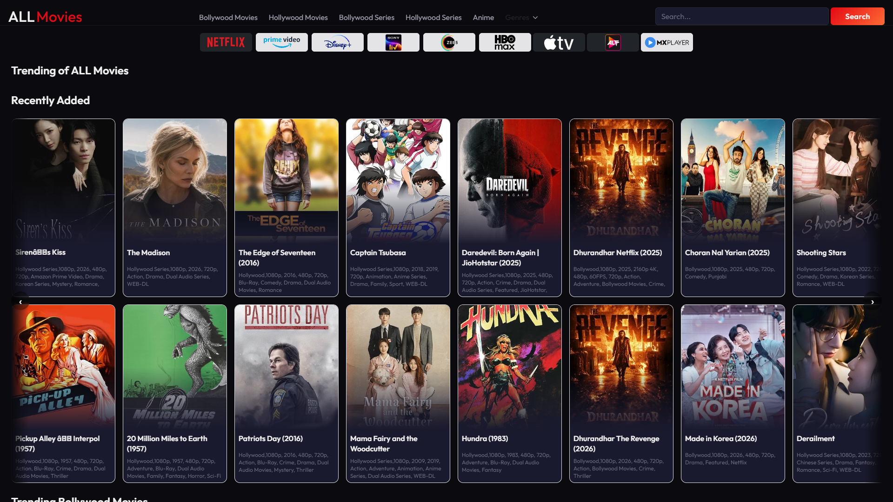
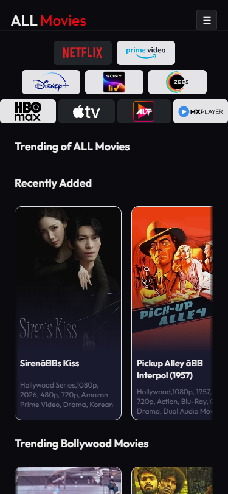

🎬 ALL Movies — Your Movie Playground
=================================

Welcome! 🎉

ALL Movies is a friendly, fast, and focused movie UI.
Packed with neat UI pieces, smooth navigation, and ✨ delightful UX.

## 📸 Screenshots

### Web View


### Mobile View



🌐 Live Website
----------------

🔗 **[https://all-movies-sayan.vercel.app/](https://all-movies-sayan.vercel.app/)**

📌 Original Repository
-----------------------

This project is forked from the original **MovieHub** repository by **Harsh**:

🔗 **[https://github.com/harshstrr/MovieHub](https://github.com/harshstrr/MovieHub)**

Why ALL Movies
-----------

- ❤️ Designed for movie lovers
- ⚡ Snappy interactions
- 📱 Works great on mobile & desktop
- 🎨 Premium dark theme with glassmorphism & animations

Top Features
------------

- 🎞️ Browse curated lists
- 🔎 Fast search & filter
- ⭐ Mark favorites
- 🗂️ Simple, clear pages
- ♿ Accessibility-aware

What you'll see
---------------

- Nice card grid for titles
- Detail pages with poster + meta
- Responsive navbar
- Micro-animations for polish
- Dark mode with gradient accents

Tech Stack
----------

- Angular — app core
- Tailwind CSS — utilities
- Bootstrap — grid & helpers
- Vite / static output via Angular build

Project Layout
--------------

- `src/` — source
	- `app/` — app code
		- `components/` — reusable UI
			- `card/`, `navbar/`, `footer/`
		- `pages/` — views
			- `home/`, `content/`, `content-detail/`, `search-results/`
		- `api/` — config & endpoints (internal)
	- `styles.css` — global styles

Install & Run (local)
---------------------

1) Install deps

```bash
npm install
```

2) Start dev server

```bash
npm start
```

3) Open in browser

```bash
http://localhost:4200
```

Build (prod)
------------

```bash
npm run build
```

This outputs a static build suitable for hosting.

Dev Tips
--------

- Use small poster images for speed 🖼️
- Run in mobile viewport to test layout 📱
- Keep component props tiny and focused ✂️

Styling & Theme
---------------

- Tailwind gives utility classes
- Bootstrap used for helpers & grid
- Premium dark theme with glassmorphism effects

Accessibility
-------------

- Keyboard navigation friendly ⌨️
- Contrast-conscious colors
- Alt text on images recommended

Testing
-------

- Unit tests live near components
- Run tests with your test script

Contributing
------------

- Love it? Help out! 🙌
- Fork → branch → PR
- Keep PRs small & focused
- Use clear commit messages

Code Style
----------

- Prefer readable names
- Small functions > big ones
- Keep CSS scoped to components

Deployment
----------------

- Deployed on **Vercel**: [https://all-movies-sayan.vercel.app/](https://all-movies-sayan.vercel.app/)

Troubleshooting
---------------

- Dev server won't start? Check logs.
- Layout odd on mobile? Clear cache, test emulation.

Roadmap
-------

- Add user favorites persistence
- Improve search UX
- More themes & small UX polish

Credits
-------

- Original project by [Harsh](https://github.com/harshstrr/MovieHub)
- Forked & redesigned by Sayan Pal

Contact
-------

- Say hi and share ideas! 💌

License
-------

- MIT -

Thanks for checking out ALL Movies! 🍿


